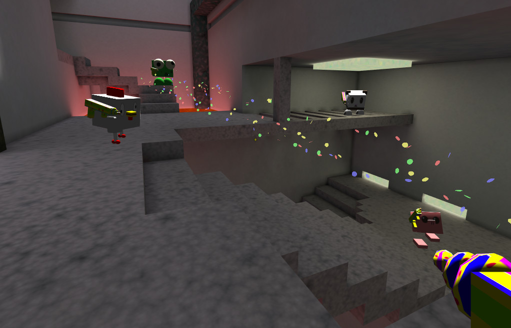

# Scáthanna

A 3D multiplayer shooter.



## Quickstart

1. Install Rust as per https://www.rust-lang.org/tools/install.

2. Fetch and compile:
```
git clone https://github.com/barnex/scathanna.git`
cd scathanna
cargo install --path scathanna_client
```

3. (Optional) install the game server:
```
cargo install --path scathanna_server
```

4. Connect to a game server;
```
scathanna_client join 111.222.333.444:5555 --name Bob
```

## Client options

These are the most useful command-line options when joining a game:

  * `--name MyName` sets your nickname
  * `--avatar frog|panda|turkey|pig|hamster|chicken|bunny` sets how you look

E.g.:

```
scathanna_client join join 111.222.333.444:5555 --name Chuck --avatar chicken
```

## Graphics/input options

Graphics options are passed before `join`:

```
scathanna_client --no-vsync --fullscreen join 111.222.333.444:5555 --name Alice
```
The most useful options are:

  * `--no-vsync` Disable vertical sync. Use this on slow hardware if your FPS counter runs below 60 FPS.
  * `--msaa=4` Set anti-aliasing quality (1,2,4,8,...). Useful on slow hardware.
  * `--fullscreen` Run in borderless fullscreen mode.
  * `--mouse-sens=100` Set mouse sensitivity (100 = normal speed).


E.g.:

```
scathanna_client \
   --fullscreen \
   --no-vsync \
   --msaa=2 \
   --mouse-sens 150 \
   join 111.222.333.444:5555 --name Sloth
```
